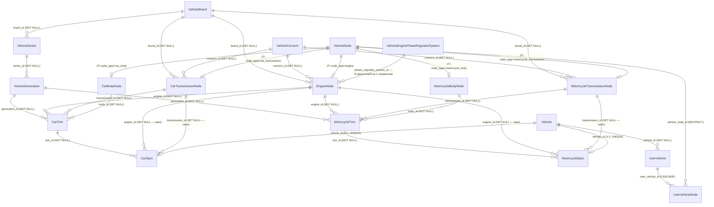

# Граф моделей данных модуля `vehicles`

> **Статус:** Все шаги реализованы (2026-05-27). Миграции: ac7cd3d386a4, 5227f16cea20, 957661a10bd9, eadcdf7ec004, 4f43d74dc3d1, 0bd8baffd531, f94b26d2a4b6, 822d8cec7482, 2d0c4b831eae.
>
> **Обновление (2026-05-29) — унификация узлов ТС (JTI):** двигатель/КПП/кузов
> унифицированы в `VehicleNode` через Joined Table Inheritance. Подробности и
> предыстория решений — в `docs/plans/унификация-узлов-тс-vehicle-node.md`.
> Миграция: `beaf2f8564a1`. Раздел 3 (диаграмма) и глоссарий ниже отражают
> уже новую модель; разделы 6–10 — исторический контекст исходного рефакторинга
> GRAPH и могут ссылаться на старые имена таблиц (`VehicleEngine`,
> `CarTransmission`, `CarBody`, `MotorcycleTransmission`, `MotorcycleBody`),
> которых больше нет.

## 1. Введение

Документ описывает текущее состояние модели данных модуля `backend/apps/vehicles/models/`:
- все ORM-сущности модуля и их связи (направленность, имя FK-поля, кардинальность, `back_populates`, `on_delete`);
- внешние связи модуля (`Country` из `apps/geo`, `User` из `apps/accounts`);
- найденные недостатки и пошаговый план их исправления.

Документ предназначен для разработчиков как референс при доработке моделей и проектировании миграций. Все связи установлены на основе чтения файлов модуля и общего mixin `common/models/mixins/relations.py` (`get_foreign_key_mixin`).

---

## 2. Глоссарий терминов

| Термин | Файл | Назначение |
|---|---|---|
| `Concern` | `vehicle/vehicle_concern.py` | Концерн/альянс/группа автопроизводителей (VAG, Hyundai-KIA). |
| `Manufacturer` | `manufacturer.py` | Автопроизводитель (завод). Сейчас — пустая заглушка с TODO. |
| `Brand` | `vehicle/vehicle_brand.py` | Торговая марка (Skoda, BMW, Lada). |
| `Series` | `vehicle/vehicle_series.py` | Модельный ряд бренда (Octavia, Vesta). Родитель для Car/Motorcycle поколений. |
| `Generation` | `vehicle/vehicle_generation.py` | Поколение модели (E34, Polo 2). |
| `Trim` | `car/car_trim.py`, `motorcycle/motorcycle_trim.py` | Комплектация (Club# Lada Granta). |
| `VehicleNode` | `node/vehicle_node.py` | Базовый узел/агрегат ТС (JTI root). Несёт только `id` + `node_type`. Единая адресуемая сущность для основных агрегатов. |
| `EngineNode` | `node/engine_node.py` | Двигатель как узел (деталь JTI). Поля двигателя + brand/concern + `phase_regulator_system_id`. |
| `CarTransmissionNode` / `MotorcycleTransmissionNode` | `node/transmission_node.py` | Коробка передач как узел (детали JTI). |
| `CarBodyNode` / `MotorcycleBodyNode` | `node/body_node.py` | Кузов как узел (детали JTI). |
| `PhaseRegulatorSystem` | `vehicle/vehicle_engine_phase_regulator_system.py` | Система управления фазами (фазорегулятор). НЕ узел — обычный справочник, явный FK с `EngineNode`. Один справочник ставится в N двигателей («несколько parent» на уровне справочника). |
| `Spec` | `car/car_spec.py`, `motorcycle/motorcycle_spec.py` | Заводская спецификация конкретного экземпляра (VIN, гос. номер, trim, опц. свап двигателя/КПП). |
| `Vehicle` | `vehicle/vehicle.py` | Общая модель ТС как объекта реального мира (тип, год, цвет, страна). |
| `UserVehicle` | `vehicle/user_vehicle.py` | Факт владения экземпляром ТС конкретным пользователем. |
| `UserVehicleNode` | `node/user_vehicle_node.py` | Экземпляр узла на машине пользователя (`user_vehicle_id` + `vehicle_node_id` + `notes`). Якорь для пер-машинных событий. M2M с `VehicleReminder` через `reminder_node_link`. |
| `Reminder` | `vehicle/reminder.py` | Напоминание по ТС пользователя. Привязано к `UserVehicle`; M2M с `UserVehicleNode` («всё, что связано с двигателем»). |
| `Group` | `vehicle/vehicle_group.py` | Пользовательская группа в гараже (без связи с UserVehicle). |

---

## 3. Граф связей (Mermaid `erDiagram`)

Диаграмма ограничена моделями модуля `vehicles/models` и фокусируется на связях
ТС ↔ агрегаты (узлы). Внешние сущности (`Country`, `User`) и периферийные модели
(`VehicleGroup`, `VehicleReminder`) опущены — они описаны в глоссарии и таблице
связей.



Как читать диаграмму:
- Подпись на ребре — имя FK-колонки в таблице-источнике (`<relation_name>_id`) и `on_delete`.
- `VehicleNode ||--o| *Node` — Joined Table Inheritance: каждая деталь хранит `id` как PK + FK на `vehicle_node.id`.
- `PhaseRegulatorSystem → EngineNode` — один справочник фазорегулятора ставится в N двигателей («несколько parent» на уровне справочника).
- Trim/Spec ссылаются на узлы типизированными FK; `CarSpec.engine_id`/`transmission_id` — опциональный свап (NULL ⇒ берётся из `trim`).
- `UserVehicleNode` — экземпляр узла на машине пользователя (якорь событий).

---

## 4. Таблица связей

| Откуда (FK owner) | Поле FK | Куда | back_populates | Кардинальность | nullable | on_delete |
|---|---|---|---|---|---|---|
| `VehicleBrand` | `country_id` | `Country` | `brands` | N:1 | нет | CASCADE |
| `VehicleBrand` | `concern_id` | `VehicleConcern` | `brands` | N:1 | да | CASCADE (баг) |
| `VehicleConcern` | `country_id` | `Country` | `concerns` | N:1 | да | CASCADE (баг) |
| `VehicleSeries` | `brand_id` | `VehicleBrand` | `series` | N:1 | нет | CASCADE |
| `VehicleGeneration` | `series_id` | `VehicleSeries` | `generations` | N:1 | нет | CASCADE |
| `VehicleEngine` | `brand_id` | `VehicleBrand` | `engines` | N:1 | да | CASCADE (баг) |
| `VehicleEngine` | `concern_id` | `VehicleConcern` | `engines` | N:1 | да | CASCADE (баг) |
| `VehicleEngine` | `phase_regulator_system_id` | `VehicleEnginePhaseRegulatorSystem` | `engines` | N:1 | да | CASCADE (баг) |
| `VehicleEnginePhaseRegulatorSystem` | `brand_id` | `VehicleBrand` | `phase_regulator_systems` | N:1 | да | CASCADE (баг) |
| `VehicleEnginePhaseRegulatorSystem` | `concern_id` | `VehicleConcern` | `phase_regulator_systems` | N:1 | да | CASCADE (баг) |
| `Vehicle` | `country_id` | `Country` | `vehicles` | N:1 | да | CASCADE (баг) |
| `CarSpec` | `vehicle_id` | `Vehicle` | `car_spec` | заявлено 1:1, фактически N:1 (баг) | нет | CASCADE |
| `CarSpec` | `generation_id` | `VehicleGeneration` | — (back_populates=None) | N:1 | нет | CASCADE |
| `MotorcycleSpec` | `vehicle_id` | `Vehicle` | `motorcycle_spec` | заявлено 1:1, фактически N:1 (баг) | нет | CASCADE |
| `MotorcycleSpec` | `generation_id` | `VehicleGeneration` | — (back_populates=None) | N:1 | нет | CASCADE |
| `CarTransmission` | `brand_id` | `VehicleBrand` | `car_transmissions` | N:1 | да | CASCADE (баг) |
| `CarTransmission` | `concern_id` | `VehicleConcern` | `car_transmissions` | N:1 | да | CASCADE (баг) |
| `MotorcycleTransmission` | `brand_id` | `VehicleBrand` | `motorcycle_transmissions` | N:1 | да | CASCADE (баг) |
| `MotorcycleTransmission` | `concern_id` | `VehicleConcern` | `motorcycle_transmissions` | N:1 | да | CASCADE (баг) |
| `CarTrim` | `engine_id` | `VehicleEngine` | `trims` | N:1 | нет | CASCADE — КОНФЛИКТ с `MotorcycleTrim` |
| `CarTrim` | `generation_id` | `VehicleGeneration` | `car_trims` | N:1 | нет | CASCADE |
| `CarTrim` | `transmission_id` | `CarTransmission` | `car_trims` | N:1 | нет | CASCADE |
| `CarTrim` | `body_id` | `CarBody` | `car_trims` | N:1 | нет | CASCADE |
| `MotorcycleTrim` | `engine_id` | `VehicleEngine` | `trims` | N:1 | нет | CASCADE — КОНФЛИКТ с `CarTrim` |
| `MotorcycleTrim` | `generation_id` | `VehicleGeneration` | `motorcycle_trims` | N:1 | нет | CASCADE |
| `MotorcycleTrim` | `transmission_id` | `MotorcycleTransmission` | `motorcycle_trims` | N:1 | нет | CASCADE |
| `MotorcycleTrim` | `body_id` | `MotorcycleBody` | `motorcycle_trims` | N:1 | нет | CASCADE |
| `UserVehicle` | `user_id` | `User` | `vehicles` | N:1 | нет | CASCADE |
| `UserVehicle` | `vehicle_id` | `Vehicle` | `user_vehicles` | N:1 | нет | CASCADE |
| `VehicleGroup` | `user_id` | `User` | `groups` | N:1 | нет | CASCADE |

Примечание: значение `on_delete='CASCADE'` фактически задаётся в `common/models/mixins/relations.py:19` как дефолт для всех FK, поэтому даже для nullable-связей (которые семантически должны быть `SET NULL`) применяется `CASCADE`. Помечено как «(баг)» в таблице.

---

## 5. Пояснения к графу

### 5.1. Подграф «Справочник» — Brand / Concern / Series / Generation

Это иерархическая ось каталога ТС:

```
Country ─┐
         ├── VehicleConcern (опц.) ── VehicleBrand ── VehicleSeries ── VehicleGeneration
Country ─┘                            │
                                       └── Country (страна бренда — отдельная связь)
```

- `VehicleBrand` обязательно привязан к `Country`. `VehicleConcern` — опционально.
- `VehicleSeries.vehicle_type` дублирует подтип (CAR/MOTORCYCLE), который дальше используется в подграфе экземпляров.
- На уровне `VehicleSeries` действует `UNIQUE(brand_id, name)`.

### 5.2. Подграф «Узлы ТС» — VehicleNode (JTI) / PhaseRegulatorSystem / Trim

Технические узлы унифицированы в `VehicleNode` через Joined Table Inheritance
(см. `docs/plans/унификация-узлов-тс-vehicle-node.md`):

- `VehicleNode` (таблица `vehicle_node`) — базовый узел-якорь, несёт только `id` и
  `node_type` (JTI-дискриминатор). Открытый набор типов: новый тип = новый
  подкласс-деталь + миграция.
- Детали JTI (каждая своя таблица, `id` = PK + FK на `vehicle_node.id`,
  `polymorphic_identity`):
  - `EngineNode` — характеристики двигателя, brand/concern, явный FK
    `phase_regulator_system_id`.
  - `CarTransmissionNode` / `MotorcycleTransmissionNode` — общие поля КПП через
    mixin `TransmissionNodeFieldsMixin` + специфичные, brand/concern.
  - `CarBodyNode` / `MotorcycleBodyNode` — общие поля через `BodyNodeFieldsMixin`.
  - Натуральные ключи уникальности (`name`, `volume`, `power`, …) и CHECK
    `brand_or_concern_required` живут на деталях (в JTI cross-table-уникальность
    невозможна).
- `PhaseRegulatorSystem` — НЕ узел, обычный справочник; один объект ставится в
  несколько `EngineNode` (явный FK `phase_regulator_system_id`). Это и есть
  «несколько parent» на уровне справочника — экземплярное дерево остаётся
  однозначным.
- `CarTrim` / `MotorcycleTrim` наследуют `VehicleTrimAbstract` и являются «точкой
  сборки» — ссылаются на Generation и на узлы (`engine_id`, `transmission_id`,
  `body_id`) с сохранёнными именами связей `engine`/`transmission`/`body`.

Связь Trim → Body — N:1 (один кузов может встречаться у нескольких комплектаций),
подтверждено владельцем как корректное бизнес-правило.

### 5.3. Подграф «Экземпляры» — Vehicle / Spec / UserVehicle / Group

- `Vehicle` — единая модель ТС реального мира, нужна для будущих кросс-доменных связей (записи в сервис, заправки, форум).
- `CarSpec` и `MotorcycleSpec` — заводские атрибуты экземпляра (VIN, госномер, номер кузова) и связь с поколением. По задумке владельца — 1:1 с `Vehicle`, но в коде это не зафиксировано (см. недостаток 2).
- `UserVehicle` — пользовательские данные владения (пробег, расход, единицы измерения). По уточнению владельца «пробег — это данные в целом по автомобилю», а сейчас он лежит в `UserVehicle` (см. недостаток 8).
- `VehicleGroup` существует, но не связана ни с `UserVehicle`, ни с `Vehicle` — группа в гараже фактически пустая (см. недостаток 14).

---

## 6. Недостатки

### 6.1. [ИСПРАВЛЕНО] Конфликт `back_populates='trims'` на `VehicleEngine`

`vehicle/abstract/vehicle_trim.py:11` объявляет `get_engine_link_mixin('trims', False)` в абстрактном базовом классе `VehicleTrimAbstract`. Оба наследника (`CarTrim`, `MotorcycleTrim`) получают одинаковый backref `trims` на `VehicleEngine`. SQLAlchemy при `configure_mappers()` сгенерирует две `relationship` с одним именем — backref будет перезаписан, либо упадёт ошибка. Корень: backref-имя задано в абстрактном базовом классе вместо подклассов.

Файлы: `backend/apps/vehicles/models/vehicle/abstract/vehicle_trim.py:11`, `backend/apps/vehicles/models/car/car_trim.py:15`, `backend/apps/vehicles/models/motorcycle/motorcycle_trim.py:7`.

### 6.2. [ИСПРАВЛЕНО] 1:1 `Vehicle ↔ Spec` не гарантирован

`get_foreign_key_mixin` (`backend/common/models/mixins/relations.py:46`) создаёт `relationship(...)` без параметра `uselist=False`. На стороне `Vehicle.car_spec` коллекция, а не один объект. Дополнительно отсутствуют:
- `UNIQUE(vehicle_id)` на `car_spec` / `motorcycle_spec`;
- CHECK/триггер на эксклюзивность по `vehicle_type` (CAR ⇒ только `CarSpec`, MOTORCYCLE ⇒ только `MotorcycleSpec`).

Файлы: `backend/apps/vehicles/models/car/car_spec.py:10-13`, `backend/apps/vehicles/models/motorcycle/motorcycle_spec.py:7-10`, `backend/apps/vehicles/models/vehicle/vehicle.py:11-19`.

### 6.3. [ИСПРАВЛЕНО / НЕ ПРИМЕНИМО] Дублирование данных между уровнями

- `drive_type` хранится и в `CarTransmission.drive_types` (массив), и в `CarTrim.drive_type` (скаляр).
  Файлы: `backend/apps/vehicles/models/car/car_transmission.py:23-26`, `backend/apps/vehicles/models/car/car_trim.py:34-37`.
- `phase_regulator_type` хранится и на `VehicleEngine`, и на `VehicleEnginePhaseRegulatorSystem` (которая сама связана с двигателем).
  Файлы: `backend/apps/vehicles/models/vehicle/vehicle_engine.py:36-38`, `backend/apps/vehicles/models/vehicle/vehicle_engine_phase_regulator_system.py:26-28`.
- `body_str` на `CarTrim` (текстовое представление кузова) параллелен нормализованному `CarBody`.
  Файл: `backend/apps/vehicles/models/car/car_trim.py:39`.

Примечание: `VehicleEngine.torque` и `CarTransmission.torque` — независимые атрибуты (момент двигателя vs максимально допустимый входной момент КПП), дублированием не являются. Нужно лишь уточнить doc-строки, явно разграничивающие смысл.

### 6.4. [ИСПРАВЛЕНО] `Numeric(3, 2)` для расхода/разгона

Точность позволяет максимум `9.99`. Реальные расходы 10–20 л/100 км и время разгона 10+ с не помещаются. Нужно `Numeric(4, 2)` или `Numeric(5, 2)`.

Файлы: `backend/apps/vehicles/models/car/car_trim.py:26-33`, `backend/apps/vehicles/models/vehicle/user_vehicle.py:25-28`.

### 6.5. [ИСПРАВЛЕНО] `Vehicle.color` — расхождение аннотации и DDL

`Mapped[str | None] = mapped_column(String(100), ...)` — Python-аннотация говорит «может быть None», а в `mapped_column` `nullable` не задан (по умолчанию False для не-Optional ORM-аннотации, но `Mapped[X | None]` обычно делает `nullable=True`; поведение зависит от версии SQLAlchemy и может расходиться с `ty`). Нужно явно `nullable=True`.

Файл: `backend/apps/vehicles/models/vehicle/vehicle.py:21`.

### 6.6. [ИСПРАВЛЕНО] `Vehicle.production_year` и Generation.start/end_year

`Vehicle.production_year` хранится без связи с поколением (Generation доступен только через `Spec`). Проверка `production_year ∈ [start_year, end_year]` нигде не выражена.

Файлы: `backend/apps/vehicles/models/vehicle/vehicle.py:20`, `backend/apps/vehicles/models/vehicle/vehicle_generation.py:20-21`.

### 6.7. [ИСПРАВЛЕНО] `CarSpec`/`MotorcycleSpec` не ссылаются на `Trim` (и `generation_id` денормализован)

На уровне БД нет фиксации, какой именно комплектацией владеет экземпляр. Сейчас на Spec лежит `generation_id`, а `trim_id` отсутствует вовсе. По уточнению владельца Spec — это «заводские данные (марка, модель, кузов, поколение, комплектация)», значит trim обязан быть.

После добавления `trim_id` хранение `generation_id` на Spec становится денормализованным дубликатом: Generation всегда достаётся через `spec.trim.generation`. Решено (см. шаг 3): `generation_id` с Spec убрать, оставить только `trim_id`.

Цепочка получения полных данных об экземпляре:
`UserVehicle.vehicle → Vehicle.car_spec → CarSpec.trim → CarTrim.generation → VehicleGeneration.series → VehicleSeries.brand → VehicleBrand.concern`.

Файлы: `backend/apps/vehicles/models/car/car_spec.py:10-21`, `backend/apps/vehicles/models/motorcycle/motorcycle_spec.py:7-14`.

### 6.8. [ИСПРАВЛЕНО] `mileage` находится на `UserVehicle`, а должен быть на `Vehicle`/`Spec`

По уточнению владельца «VIN и пробег — это данные в целом по автомобилю, они не зависят от конкретного пользователя». Сейчас при смене владельца пробег теряется.

Файл: `backend/apps/vehicles/models/vehicle/user_vehicle.py:19-21`.

### 6.9. [ИСПРАВЛЕНО] `on_delete='CASCADE'` по умолчанию даже для nullable FK

`get_foreign_key_mixin` в `backend/common/models/mixins/relations.py:19` устанавливает `on_delete: PostgresOnDeleteFK = "CASCADE"` как дефолт сигнатуры. Ветка `if nullable and on_delete is None: on_delete = 'SET NULL'` никогда не сработает, потому что параметр уже не `None`. В итоге удаление `Country` каскадно сотрёт все `VehicleBrand` этой страны, удаление `VehicleConcern` сотрёт все `VehicleBrand` концерна и т. д.

Файл: `backend/common/models/mixins/relations.py:12-35`.

### 6.10. [ИСПРАВЛЕНО] Двойное «владение» — `brand_id` + `concern_id`

На `VehicleEngine`, `VehicleEnginePhaseRegulatorSystem`, `CarTransmission`, `MotorcycleTransmission` одновременно есть оба nullable-FK. Можно указать обоих, никого, или несогласованную пару (concern не содержит этот brand). Нет CHECK-ограничения.

Файлы: `backend/apps/vehicles/models/vehicle/vehicle_engine.py:13-18`, `backend/apps/vehicles/models/vehicle/vehicle_engine_phase_regulator_system.py:13-18`, `backend/apps/vehicles/models/car/car_transmission.py:13-18`, `backend/apps/vehicles/models/motorcycle/motorcycle_transmission.py:13-18`.

### 6.11. [ИСПРАВЛЕНО] `VehicleBodyAbstract.material` — несоответствие типа Python и колонки

`Mapped[str | None] = mapped_column(IntFlagType(VehicleBodyType), ...)` — аннотация `str | None`, а в БД хранится `IntFlag`. `ty` должен ругаться.

Файл: `backend/apps/vehicles/models/vehicle/abstract/vehicle_body.py:18`.

### 6.12. [НЕ ПРИМЕНИМО] Неполная типизация комбинаций ремень/цепь ГРМ

`VehicleEngineGRMType` (`IntFlag`) позволяет комбинировать, но количество ремней/цепей структурно не хранится. TODO в `vehicle_engine.py:31-32` фиксирует проблему. Нужно добавить отдельные поля `belts_count`, `chains_count` или нормализовать.

Файл: `backend/apps/vehicles/models/vehicle/vehicle_engine.py:31-35`.

### 6.13. [ИСПРАВЛЕНО] Слабая типизация `VehicleTrimAbstract.options`

`Mapped[dict | None]` без параметризации ключей/значений нарушает требование проекта о полной типизации (см. AGENTS.md). Должно быть `dict[str, Any] | None` или конкретный `TypedDict`. Дополнительно — `default={}` создаёт колоночный дефолт (на уровне БД ок), но семантически рискованно.

Файл: `backend/apps/vehicles/models/vehicle/abstract/vehicle_trim.py:19`.

### 6.14. [ИСПРАВЛЕНО] `VehicleGroup` ни с чем не связана

Модель «Группа ТС» имеет только `user_id`, но никаких связей с `UserVehicle` / `Vehicle`. По смыслу группа должна содержать ТС пользователя. Сейчас группа всегда пустая.

Файл: `backend/apps/vehicles/models/vehicle/vehicle_group.py:8-17`.

### 6.15. [ИСПРАВЛЕНО] `Manufacturer` — пустая TODO-заглушка

Файл содержит только комментарий. Если сущность нужна — реализовать с FK `VehicleBrand.manufacturer_id`. Если не нужна — удалить файл.

Файл: `backend/apps/vehicles/models/manufacturer.py:1-2`.

### 6.16. [НЕ ПРИМЕНИМО] Концепция `Concern` пересекается с будущим `Manufacturer`

Когда появится `Manufacturer` (завод), потребуется явная развязка: концерн = группа брендов, manufacturer = производственное предприятие. Сейчас концерн в коде совпадает с «автопроизводителем» по смыслу, что подтверждено комментарием в `manufacturer.py:1-2` («не путать с торговой маркой»).

Файлы: `backend/apps/vehicles/models/vehicle/vehicle_concern.py`, `backend/apps/vehicles/models/manufacturer.py`.

### 6.17. [ИСПРАВЛЕНО] Терминология `VehicleSeries`

Docstring `vehicle/vehicle_series.py:15-18` говорит «Модель марки ТС», тогда как имя класса — Series. Возможна путаница с понятиями «Vehicle Model» в кодогенерации TypeScript. Стоит зафиксировать терминологию в этом документе и/или переименовать класс.

Файл: `backend/apps/vehicles/models/vehicle/vehicle_series.py:11-21`.

### 6.18. [ИСПРАВЛЕНО] Недостаточные уникальные ограничения

- `VehicleEngine`: нет `UNIQUE(brand_id, name)`.
- `VehicleGeneration`: нет `UNIQUE(series_id, name, is_restyling)`.
- `CarSpec.vin` и `MotorcycleSpec.vin` (если будет добавлен) — нет `UNIQUE(vin)`.
- `body_number` на `CarSpec` — потенциально тоже уникален.

Файлы: `backend/apps/vehicles/models/vehicle/vehicle_engine.py:13-38`, `backend/apps/vehicles/models/vehicle/vehicle_generation.py:9-21`, `backend/apps/vehicles/models/car/car_spec.py:10-21`.

### 6.19. [ИСПРАВЛЕНО] `generation_id` на Spec без `back_populates` (устраняется удалением поля)

`CarSpec` и `MotorcycleSpec` передают `back_populates=None` в `get_vehicle_generation_link_mixin(None, False)`. Generation не знает свои Spec, нельзя из ORM получить «все ТС этого поколения».

В рамках шага 3 поле `generation_id` удаляется с Spec, и проблема снимается. Новая связь `CarSpec.trim_id`/`MotorcycleSpec.trim_id` должна сразу заводиться с `back_populates='specs'` (или с разными именами `car_specs`/`motorcycle_specs`, если оставить общий backref недопустимо).

Файлы: `backend/apps/vehicles/models/car/car_spec.py:13`, `backend/apps/vehicles/models/motorcycle/motorcycle_spec.py:10`.

### 6.20. [ИСПРАВЛЕНО] `CarTrim.body_id NOT NULL` при существующем `body_str`

`CarTrim` требует обязательный `body_id`, но рядом есть `body_str` как «временное решение» именно для случая, когда `CarBody` ещё не создан. NOT NULL FK + параллельная текстовая колонка — внутреннее противоречие.

Файл: `backend/apps/vehicles/models/car/car_trim.py:19, 38-39`.

### 6.21. [ИСПРАВЛЕНО] Нет фактического двигателя/КПП на экземпляре (свап не отражается)

Сейчас `engine_id` и `transmission_id` хранятся только на Trim (заводская конфигурация). При свапе двигателя или КПП у конкретного экземпляра это не отражается в БД — у двух авто с одинаковой комплектацией обязательно один и тот же двигатель.

Решение (см. шаг 3): добавить опциональные `engine_id` и `transmission_id` на `CarSpec`/`MotorcycleSpec`. Семантика: `NULL` ⇒ совпадает с `trim.engine` / `trim.transmission`; не-NULL ⇒ свап, фактическое железо отличается от заводского.

Файлы: `backend/apps/vehicles/models/car/car_spec.py`, `backend/apps/vehicles/models/motorcycle/motorcycle_spec.py`, `backend/apps/vehicles/models/vehicle/vehicle_engine.py`, `backend/apps/vehicles/models/car/car_transmission.py`, `backend/apps/vehicles/models/motorcycle/motorcycle_transmission.py`.

---

## 7. Шаги исправления

Порядок продиктован зависимостями (см. раздел 8).

### Шаг 1. [ВЫПОЛНЕНО] Починить `back_populates` для `engine` в Trim

Перенести `get_engine_link_mixin` из `VehicleTrimAbstract` (`vehicle/abstract/vehicle_trim.py`) в `CarTrim` и `MotorcycleTrim` с разными именами backref: `car_trims` и `motorcycle_trims` соответственно.

Файлы: `backend/apps/vehicles/models/vehicle/abstract/vehicle_trim.py`, `backend/apps/vehicles/models/car/car_trim.py`, `backend/apps/vehicles/models/motorcycle/motorcycle_trim.py`.

### Шаг 2. [ВЫПОЛНЕНО] Гарантировать 1:1 `Vehicle ↔ Spec` и эксклюзивность подтипа

- Расширить `get_foreign_key_mixin` параметром `uselist: bool = True` (или добавить отдельный `get_one_to_one_link_mixin`), пробросить в `relationship(...)`.
- Добавить `UNIQUE(vehicle_id)` на `CarSpec`, `MotorcycleSpec`.
- Добавить CHECK (или триггер): `vehicle_type=CAR ⇒ есть строка только в `car_spec`; `vehicle_type=MOTORCYCLE ⇒ только в `motorcycle_spec``. Альтернатива — SQLAlchemy polymorphic on `vehicle_type` для самих Spec.

Файлы: `backend/common/models/mixins/relations.py`, `backend/apps/vehicles/models/car/car_spec.py`, `backend/apps/vehicles/models/motorcycle/motorcycle_spec.py`, новая Alembic-миграция.

### Шаг 3. [ВЫПОЛНЕНО] Зафиксировать «инстанс vs справочник», связать Spec с Trim, добавить фактическое железо

Решение по результатам обсуждения с владельцем (Вариант A нормализации):

- **Добавить `trim_id` на `CarSpec` / `MotorcycleSpec`** (NOT NULL, FK на `CarTrim` / `MotorcycleTrim` соответственно). `back_populates`: рекомендуется `specs` (либо `car_specs` / `motorcycle_specs`, если general backref конфликтует).
- **Удалить `generation_id` с `CarSpec` / `MotorcycleSpec`** — он становится денормализованным дубликатом, поколение всегда достаётся через `spec.trim.generation`. Это автоматически закрывает недостаток 6.19.
- **Добавить опциональные `engine_id` и `transmission_id` на `CarSpec` / `MotorcycleSpec`** (nullable, `on_delete='SET NULL'`). Семантика: `NULL` ⇒ совпадает с заводской конфигурацией (`spec.trim.engine` / `spec.trim.transmission`); не-NULL ⇒ свап, фактическое железо экземпляра. `back_populates`: `car_specs` / `motorcycle_specs` на `VehicleEngine` и на соответствующих `*Transmission`.
- В docstring `Vehicle` зафиксировать: «Vehicle = экземпляр реального мира; Brand→Series→Generation→Trim — справочник заводских конфигураций».
- В docstring `CarSpec` / `MotorcycleSpec` зафиксировать правило fallback: «`engine` / `transmission` `None` ⇒ читать из `trim.engine` / `trim.transmission`». Реализовать helper-проперти `effective_engine`, `effective_transmission`.

Файлы: `backend/apps/vehicles/models/car/car_spec.py`, `backend/apps/vehicles/models/motorcycle/motorcycle_spec.py`, `backend/apps/vehicles/models/vehicle/vehicle.py`, новая Alembic-миграция (drop `generation_id`, add `trim_id` NOT NULL, add `engine_id` / `transmission_id` nullable).

### Шаг 4. [ВЫПОЛНЕНО] Перенести `mileage` с `UserVehicle` на `Vehicle` (или Spec)

Удалить `mileage` и `is_mileage_in_miles` из `UserVehicle`. Добавить их в `Vehicle` (или в `CarSpec`/`MotorcycleSpec`, если пробег уместнее держать на заводском экземпляре). `UserVehicle` оставить под `avg_fuel_consumption`, заметки, фото.

Реальных пользователей в приложении пока нет — data-миграция не нужна, достаточно структурной Alembic-миграции `drop_column` + `add_column`.

Файлы: `backend/apps/vehicles/models/vehicle/user_vehicle.py`, `backend/apps/vehicles/models/vehicle/vehicle.py`, новая Alembic-миграция.

### Шаг 5. [ВЫПОЛНЕНО] Устранить дублирование атрибутов

- Удалить `VehicleEngine.phase_regulator_type` (использовать через связанный `VehicleEnginePhaseRegulatorSystem.phase_regulator_type`).
- Удалить либо `CarTrim.drive_type`, либо `CarTransmission.drive_types`, определив источник истины (рекомендация: оставить `CarTransmission.drive_types`, т. к. трансмиссия определяет привод).
- Удалить `CarTrim.body_str` после нормализации (см. шаг 1 и шаг 3).
- Уточнить doc-строки для `VehicleEngine.torque` («крутящий момент двигателя, Нм») и `CarTransmission.torque` («максимально допустимый входной момент КПП, Нм») — это независимые атрибуты, не дубли.

Файлы: `backend/apps/vehicles/models/vehicle/vehicle_engine.py`, `backend/apps/vehicles/models/car/car_transmission.py`, `backend/apps/vehicles/models/car/car_trim.py`.

### Шаг 6. [ВЫПОЛНЕНО] Исправить числовые поля

- `Numeric(3,2)` → `Numeric(4,2)` для `avg_fuel_consumption`, `acceleration` на `CarTrim` и `UserVehicle`.
- Добавить CHECK `production_year BETWEEN 1885 AND <current_year>+1` на `Vehicle`, аналогично на `start_year`/`end_year` для `VehicleGeneration`.

Файлы: `backend/apps/vehicles/models/car/car_trim.py`, `backend/apps/vehicles/models/vehicle/user_vehicle.py`, `backend/apps/vehicles/models/vehicle/vehicle.py`, `backend/apps/vehicles/models/vehicle/vehicle_generation.py`.

### Шаг 7. [ВЫПОЛНЕНО] Исправить `Vehicle.color`

Явно `mapped_column(String(100), nullable=True, ...)` или убрать `| None` из аннотации. Сверить с `ty check`.

Файл: `backend/apps/vehicles/models/vehicle/vehicle.py:21`.

### Шаг 8. [ВЫПОЛНЕНО] Исправить `VehicleBodyAbstract.material`

Заменить аннотацию `Mapped[str | None]` на `Mapped[VehicleBodyType | None]`, оставив `IntFlagType(VehicleBodyType)` в `mapped_column`.

Файл: `backend/apps/vehicles/models/vehicle/abstract/vehicle_body.py:18`.

### Шаг 9. [ВЫПОЛНЕНО] Исправить дефолт `on_delete` в `get_foreign_key_mixin`

В сигнатуре сделать `on_delete: PostgresOnDeleteFK | None = None`. В теле:
- если `on_delete is None` и `nullable=True` → `SET NULL`;
- если `on_delete is None` и `nullable=False` → `CASCADE` (или `RESTRICT`, обсудить отдельно).

После правки пройти миграцией по всем nullable FK модуля: `country_id` у `VehicleConcern`, `VehicleEngine`, `Vehicle`, `concern_id` у `VehicleBrand`, `VehicleEngine`, `VehicleEnginePhaseRegulatorSystem`, `CarTransmission`, `MotorcycleTransmission`, `brand_id` у `VehicleEngine`, `VehicleEnginePhaseRegulatorSystem`, `CarTransmission`, `MotorcycleTransmission`, `phase_regulator_system_id` у `VehicleEngine`.

Файлы: `backend/common/models/mixins/relations.py`, Alembic-миграция (переопределение ON DELETE для затронутых FK).

### Шаг 10. [ВЫПОЛНЕНО] CHECK «brand_id XOR concern_id» (или нормализация)

Добавить CHECK-ограничение «`brand_id IS NOT NULL OR concern_id IS NOT NULL`» на `VehicleEngine`, `VehicleEnginePhaseRegulatorSystem`, `CarTransmission`, `MotorcycleTransmission`. Идеально — XOR, либо отдельная вспомогательная сущность «производитель узла». Решить отдельно: допустим ли узел, общий для нескольких брендов одного концерна.

Файлы: те же четыре модели.

### Шаг 11. [ВЫПОЛНЕНО] Добавить недостающие unique-индексы

- `UNIQUE(brand_id, name)` на `VehicleEngine`.
- `UNIQUE(series_id, name, is_restyling)` на `VehicleGeneration`.
- `UNIQUE(vin)` на `CarSpec`.
- Уникальность `body_number` обсудить отдельно.

Файлы: `backend/apps/vehicles/models/vehicle/vehicle_engine.py`, `backend/apps/vehicles/models/vehicle/vehicle_generation.py`, `backend/apps/vehicles/models/car/car_spec.py`.

### Шаг 12. [ВЫПОЛНЕНО] Заведение `back_populates` для новых FK на Spec

После шага 3 на Spec появляются `trim_id`, `engine_id`, `transmission_id`. Все они должны иметь корректные `back_populates`:

- `CarSpec.trim` → `CarTrim.specs` (или `car_specs`, если нужна общая namespace на Trim).
- `MotorcycleSpec.trim` → `MotorcycleTrim.specs` (аналогично).
- `CarSpec.engine` → `VehicleEngine.car_specs`.
- `MotorcycleSpec.engine` → `VehicleEngine.motorcycle_specs`.
- `CarSpec.transmission` → `CarTransmission.car_specs`.
- `MotorcycleSpec.transmission` → `MotorcycleTransmission.motorcycle_specs`.

(Старый `generation_id` к этому моменту уже удалён шагом 3, отдельный backref на Generation не нужен — выборка «все Spec этого поколения» доступна через `generation.car_trims → trim.specs`.)

Файлы: `backend/apps/vehicles/models/car/car_spec.py`, `backend/apps/vehicles/models/motorcycle/motorcycle_spec.py`, `backend/apps/vehicles/models/car/car_trim.py`, `backend/apps/vehicles/models/motorcycle/motorcycle_trim.py`, `backend/apps/vehicles/models/vehicle/vehicle_engine.py`, `backend/apps/vehicles/models/car/car_transmission.py`, `backend/apps/vehicles/models/motorcycle/motorcycle_transmission.py`.

### Шаг 13. [ВЫПОЛНЕНО] Связать `VehicleGroup` с `UserVehicle`

Добавить `UserVehicle.group_id` (FK на `VehicleGroup`, nullable, `SET NULL`) — одна машина в одной группе. Если нужно «в нескольких» — ассоциативная таблица `user_vehicle_group_link(user_vehicle_id, group_id)`. Уточнить с владельцем.

Файлы: `backend/apps/vehicles/models/vehicle/user_vehicle.py`, `backend/apps/vehicles/models/vehicle/vehicle_group.py`, Alembic-миграция.

### Шаг 14. [ВЫПОЛНЕНО] Реализовать или удалить `Manufacturer`

Если оставлять: добавить модель `Manufacturer(AutoSchemaBase)`, FK `VehicleBrand.manufacturer_id` (N:1, nullable, `SET NULL`). Если нет — удалить файл.

Файлы: `backend/apps/vehicles/models/manufacturer.py`, `backend/apps/vehicles/models/vehicle/vehicle_brand.py`.

### Шаг 15. [ВЫПОЛНЕНО] Уточнить типизацию `VehicleTrimAbstract.options`

Заменить `Mapped[dict | None]` на `Mapped[dict[str, Any] | None]` или ввести `TypedDict` с известными опциями. Убедиться, что `tschema` корректно генерирует TS-тип.

Файл: `backend/apps/vehicles/models/vehicle/abstract/vehicle_trim.py:19`.

### Шаг 16. [ВЫПОЛНЕНО] Зафиксировать терминологию

Поддерживать актуальным глоссарий (раздел 2 этого файла). При появлении `Manufacturer` — добавить разграничение Brand/Concern/Manufacturer. При переименовании `VehicleSeries` обновить тут же.

Файл: `backend/apps/vehicles/models/GRAPH.md` (этот документ).

---

## 8. Зависимости между шагами

- **Шаг 1** (фикс `back_populates='trims'`) — независим, делать первым: текущая модель потенциально не поднимается при `configure_mappers()`.
- **Шаг 9** (правка дефолта `on_delete` в общем mixin) — должен предшествовать шагам 2, 3, 13, 14, чтобы новые FK сразу создавались с корректным `ON DELETE`.
- **Шаги 2, 3, 4** связаны: затрагивают одну ось «инстанс vs справочник» (Vehicle ↔ Spec ↔ Trim ↔ Generation, плюс перенос `mileage`). Реализовать одной миграцией.
- **Шаги 5, 11** — после шагов 2–4, чтобы устранение дублей и добавление UNIQUE не конфликтовали с текущими данными.
- **Шаги 6, 7, 8, 15** — независимы, можно параллельно.
- **Шаги 10, 12** — независимы, делать после шага 9.
- **Шаги 13, 14** — независимы между собой, делать после шага 9.
- **Шаг 16** — финальная актуализация документа после всех правок.

---

## 9. Риски

- **Реальных пользователей в БД нет**, data-миграции не требуются. Все шаги ограничены структурными правками схемы. Это снимает значительную часть обычных рисков рефакторинга.
- Изменение дефолта `on_delete` в общем mixin (шаг 9) затронет **все** модули, не только `vehicles` — нужна сверка с `accounts` (`User.country_id`) и `geo`. Если в других модулях есть осознанно установленный `CASCADE` для nullable FK — он должен быть переопределён явно перед мерджем.
- Конфликт `back_populates='trims'` (шаг 1) может уже сейчас не позволять успешно применить миграции — стоит проверить `make lint` и `alembic upgrade head` до начала любых правок.
- Семантический риск переноса `mileage` на `Vehicle` (шаг 4): один пробег на всех владельцев. Если бизнес в будущем потребует историю владения с пробегом по моменту передачи — понадобится отдельная сущность `OwnershipRecord`, не покрытая текущим планом.
- Опциональные `engine_id` / `transmission_id` на Spec (шаг 3) вводят правило fallback: «NULL ⇒ читать из trim». Если код на стороне сервисов/API не учтёт это и будет читать `spec.engine` напрямую, при отсутствии свапа получит `None` вместо ожидаемого двигателя. Нужно либо инкапсулировать в `effective_engine`/`effective_transmission`, либо в схемах reader всегда подставлять fallback.
- Удаление `CarTrim.body_str` (шаг 5) допустимо без переноса данных, но обратная миграция должна уметь восстановить колонку (для возможности `alembic downgrade -1`).

---

## 10. Критерии успеха

- `make lint` (`ruff` + `ty`) проходит без ошибок по `backend/apps/vehicles/models/`.
- `alembic upgrade head` и `alembic downgrade -1` отрабатывают чисто на дампе с реальными данными.
- `make tests` зелёный, включая новые тесты на:
  - невозможность создать `Vehicle` с двумя Spec одновременно;
  - `UNIQUE(vin)` на `CarSpec`;
  - `SET NULL` при удалении `Country`, на который ссылался `VehicleBrand`;
  - `back_populates='car_trims'` и `'motorcycle_trims'` возвращают непересекающиеся коллекции на `VehicleEngine`;
  - CHECK по `production_year` отвергает невалидные значения;
  - `CarSpec.trim_id` обязателен (NOT NULL), `CarSpec.generation_id` отсутствует в схеме;
  - `effective_engine` возвращает `trim.engine` при `spec.engine_id IS NULL` и `spec.engine` при свапе;
  - аналогично `effective_transmission` для `CarSpec` и `MotorcycleSpec`;
  - `spec.trim.generation.series.brand.concern` доступен одной цепочкой без N+1.
- `make codegen` генерирует TypeScript типы без ошибок и предупреждений.
- В Mermaid-графе раздела 3 нет CASCADE-циклов, ведущих к массовому удалению справочных данных при удалении одной записи (визуальная проверка).
- Глоссарий (раздел 2) синхронизирован с актуальным набором моделей.
