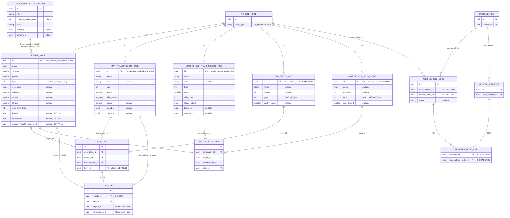

# План: унификация узлов ТС (VehicleNode) как якорь для событий

> **Статус:** план согласован, открытых вопросов нет (2026-05-29). Реализация не начата.
> **Мотивация:** нужна единая адресуемая сущность узла/агрегата ТС, к которой можно
> привязывать историю обслуживания, напоминания и прочие события, с возможностью
> группировки (например, «все события, связанные с двигателем»).

---

## 1. Цель

Унифицировать узлы/агрегаты ТС (двигатель, КПП, кузов и потенциальные подвеска,
тормоза, электрика) в единую сущность `VehicleNode`, чтобы:

- иметь **одну таблицу-якорь** для привязки `Reminder`, будущего `ServiceHistory`
  и других объектов;
- поддерживать **группировку событий по узлу** (все события двигателя конкретной машины);
- сохранить **строгую типизацию** специфичных параметров каждого типа узла;
- сохранить возможность переиспользования справочного узла в нескольких ТС
  («несколько parent» на уровне справочника).

---

## 2. Ключевые архитектурные решения (согласовано с владельцем)

| # | Вопрос | Решение |
|---|---|---|
| 1 | Унификация моделей | **Joined Table Inheritance (JTI):** базовая таблица `vehicle_node` + отдельные таблицы-детали на тип узла |
| 2 | Уровень дерева | Только справочник (каталог узлов). `parent_node_id` **пока не нужен** |
| 3 | Набор типов узлов | Открытый: новый тип = новый класс + Alembic-миграция. Сейчас: Engine, Transmission (Car/Moto), Body (Car/Moto). Потенциально: подвеска, тормоза, электрика |
| 4 | Мелкие агрегаты (фазорегулятор) | **Не узлы.** Остаются явным FK `EngineNode.phase_regulator_system_id → PhaseRegulatorSystem` (как сейчас). На события не адресуются. Возможно повышение до узла позже |
| 5 | «Несколько parent» | Реализуется на уровне справочного FK: N двигателей ссылаются на один `PhaseRegulatorSystem`. Дерево узлов остаётся one-parent (дерево, не DAG) — это устраняет неоднозначность группировки и проблему ацикличности |
| 6 | brand/concern | Остаются **на таблицах-деталях** (не на базовом `vehicle_node`): brand_id/concern_id + CHECK `brand_or_concern_required` + unique-индексы |
| 7 | Уровень привязки событий | **Вариант A:** через `UserVehicleNode` (экземпляр агрегата на конкретной машине). События ссылаются на `user_vehicle_node`, что позволяет хранить пер-агрегатные данные (последнее обслуживание, заметки, дата установки/свапа) |
| 8 | Связь Trim/Spec → узлы | Типизированные FK (`engine_id`, `transmission_id`, `body_id`) на конкретные `*Node`. Имена связей `engine`/`transmission`/`body` сохраняются |
| 9 | Связь Reminder ↔ узлы | **M2M** через `reminder_node_link` (одно напоминание может относиться к нескольким узлам). Привязка к `UserVehicleNode`, не к справочному `VehicleNode` |
| 10 | Судьба старых таблиц | Полная миграция: drop `vehicle_engine`, `car_transmission`, `motorcycle_transmission`, `car_body`, `motorcycle_body`. Реальных пользователей в БД нет — data-миграция не нужна |
| 11 | Объём итерации | Полная реализация: модели + миграция + сервисы + тесты + переписывание CSV/seed-скриптов в `backend/default_data` |

---

## 3. Модель данных



### Слой 1. `VehicleNode` — справочный якорь (JTI root)

Таблица `vehicle_node`:
- `id: UUID`
- `node_type: str` — JTI-дискриминатор (`engine`, `car_transmission`, `motorcycle_transmission`, `car_body`, `motorcycle_body`, будущие `suspension`, `brakes`, `electrics`)
- `name: Mapped[str]`

Без `parent_node_id` (добавим миграцией, когда понадобится вложенность).
`__mapper_args__ = {'polymorphic_on': node_type, 'polymorphic_identity': 'node'}`.

### Слой 2. Детали (JTI subclasses)

Каждая наследует `VehicleNode`, FK `id → vehicle_node.id`, `polymorphic_identity`.

| Класс | Таблица | Поля (из текущих моделей) |
|---|---|---|
| `EngineNode` | `engine_node` | `volume, power, type, eco_class, cylinders, valves, torque, grm_drive_type` + `phase_regulator_system_id` + brand/concern + CHECK + unique |
| `CarTransmissionNode` | `car_transmission_node` | `index, type, gears, drive_types, torque` + brand/concern + CHECK + unique |
| `MotorcycleTransmissionNode` | `motorcycle_transmission_node` | `index, type, gears, shift_type, slipper_clutch` + brand/concern + CHECK |
| `CarBodyNode` | `car_body_node` | `material, type(CarBodyType), trunk_volume` |
| `MotorcycleBodyNode` | `motorcycle_body_node` | `material, type(MotorcycleBodyType), seat_height` |

> `phase_regulator_type` убирается с `EngineNode` (живёт на `PhaseRegulatorSystem`).

### Слой 3. Мелкие агрегаты — явные FK

`PhaseRegulatorSystem` — обычная справочная таблица (НЕ наследует `VehicleNode`):
```
EngineNode.phase_regulator_system_id → PhaseRegulatorSystem  (N:1)
```
«Несколько parent» = N двигателей → один справочный фазорегулятор.

### Слой 4. `UserVehicleNode` — экземпляр узла = якорь событий

Таблица `user_vehicle_node`:
- `id: UUID`
- `user_vehicle_id → user_vehicle.id` (CASCADE)
- `vehicle_node_id → vehicle_node.id` (RESTRICT)
- `UNIQUE(user_vehicle_id, vehicle_node_id)`
- `notes: str | None` — заметка по узлу.

> **Пер-агрегатные данные — минимальный набор.** Сейчас только `notes`.
> «Последнее обслуживание», «дата установки/свапа», «пробег узла» намеренно НЕ заводятся
> отдельными колонками: их источник истины — будущий `ServiceHistory`, которого ещё нет.
> Денормализованный кэш (`last_serviced_at` и т. п.) добавим, когда появится `ServiceHistory`
> и будет чем его корректно наполнять.

### Слой 5. События ссылаются на узел-экземпляр

- `VehicleReminder ↔ UserVehicleNode` — M2M через `reminder_node_link(reminder_id, user_vehicle_node_id)`.
- `VehicleReminder.user_vehicle_id` сохраняется (как сейчас).
- Будущий `ServiceHistory.node_id → user_vehicle_node.id` (вне этой итерации).

Группировка «все события по двигателю этой машины»: через `UserVehicleNode`, где
`vehicle_node` — это `EngineNode`.

---

## 4. Стратегия исполнения (фазы)

После каждой фазы — `make lint` (ruff + ty).

### Фаза 1 — Модели [ВЫПОЛНЕНО]
- `VehicleNode` (JTI root) + 5 деталей.
- `UserVehicleNode`.
- Новые FK-миксины узлов (`get_engine_link_mixin` и пр. → на `*Node`).
- Правки `CarTrim`/`MotorcycleTrim`/`CarSpec`/`MotorcycleSpec`.
- M2M `reminder_node_link` + relationship на `VehicleReminder` и `UserVehicleNode`.
- Прогон `configure_mappers()` — риск JTI снят. Корневая правка: `AutoSchemaBase.get_table_name` теперь читает `cls.__dict__` вместо унаследованного `__tablename__`.

### Фаза 2 — Миграция [ВЫПОЛНЕНО]
- Миграция `beaf2f8564a1`: create `vehicle_node` + 5 деталей + `user_vehicle_node` + `reminder_node_link`.
- **Data-migration:** в БД оказались реальные seed-данные (3138 двигателей, 846 КПП, 2662 trim'а), поэтому допущение «данных нет» неверно. Миграция переносит справочные строки в JTI-узлы с сохранением `id` (INSERT...SELECT), затем перенаправляет FK у trim/spec, и только потом удаляет старые таблицы.
- Drop `vehicle_engine`, `car_transmission`, `motorcycle_transmission`, `car_body`, `motorcycle_body`. Фазорегулятор сохранён как справочник.
- `upgrade`/`downgrade` проверены, данные сохраняются в обе стороны.
- Ручные правки автогенерации: убраны ложные `drop_index` для `ix_vehicle_*_trgm` и reminder-индексов; починен `postgresql.ARRAY`; исправлен порядок (data → repoint FK → drop).

### Фаза 3 — Потребители кода [ВЫПОЛНЕНО]
- `apps/vehicles/services/guess_common_car_info.py` (импорты + аннотации → `EngineNode`/`CarTransmissionNode`/`CarBodyNode`; имена связей `engine`/`transmission`/`body` сохранены).
- `tests/unit/apps/vehicles/services/test_guess_common_car_info.py` (`MagicMock(spec=*Node)`) — 28 тестов зелёные.
- Поправлена устаревшая doc-ссылка в `vehicle_trim.py`.
- API-схемы/роутеры узлы не импортируют (проверено — ссылок нет).
- `otoba`-парсер и importers НЕ трогались — они в `default_data/` (Фаза 4); `ty.toml` их не анализирует, поэтому typecheck зелёный.
- Гейты: `ruff` + `ty` (весь backend) + целевой тест — зелёные.

### Фаза 4 — Seed / CSV [ВЫПОЛНЕНО]
- Добавлен `ImportJTINodesFromCSVBase` (ORM `add_all` вместо Core `insert`) — для JTI заполняет и `vehicle_node`, и деталь. `node_type` берётся из `polymorphic_identity`.
- Импортёры `vehicle_engine.py`/`car_transmissions.py` → `EngineNode`/`CarTransmissionNode`, CSV `engine_node.csv`/`car_transmission_node.csv` перегенерированы из мигрированной БД (старые CSV удалены). Фазорегулятор-импортёр не тронут.
- otoba-парсер (`parser.py`) → `EngineNode`/`CarTransmissionNode`; в `value_transformers/engine.py` убрано присвоение `phase_regulator_type` (поля больше нет на двигателе — резолвится только `phase_regulator_system_id`).
- `create_car_trims_from_pkl.py` и `import_trims_from_unresolved.py` → node-классы (с починкой импортов после replaceAll).
- `seed_all.py` — импорты по именам классов, не менялись.
- Гейты: `make seeds` отработал (3138 EngineNode + 846 CarTransmissionNode + 2662 CarTrim, JTI base заполнен корректно), `ruff` + `ty` зелёные.

### Фаза 5 — Сервис узлов + тесты + codegen [ВЫПОЛНЕНО]
- `SyncUserVehicleNodes.for_user_vehicle(user_vehicle_id)` — резолвит `UserVehicle → Vehicle → CarSpec`, собирает фактические узлы (двигатель/КПП через `effective_*` со свапом, кузов из `trim.body_id`) и идемпотентно (`insert ... on_conflict_do_nothing` по `user_vehicle_node_unique`) материализует `UserVehicleNode`. trim.engine/transmission грузятся eager (selectinload) под async-fallback `effective_*`.
- Тесты `test_sync_user_vehicle_nodes.py` (6) — приоритет свапа над trim, кузов из trim, дедуп, пустой результат без spec. Стиль unit-тестов с моками `database` (интеграционной инфры в проекте нет).
- `make codegen` — успех (схемы сгенерированы).
- Починен `core/models/loader.py`: дубль-детект теперь по `obj.__module__ == module.__name__` (реэкспорт `VehicleNode` в модули-детали больше не считается повторной загрузкой) — иначе падал `test_load_db_models`.
- Гейты: `ruff` + `ty` (весь backend) зелёные; `make tests` зелёный (137 тестов). Исключены 2 пред-существующих сломанных файла `tests/unit/scripts/` (ссылаются на удалённые до этой задачи модули `scripts.collect_models`/`generate_dataclasses`; мной не трогались).

---

## 5. Зависимости фаз

```
Фаза 1 → Фаза 2 → {Фаза 3, Фаза 4} → Фаза 5
```

---

## 6. Риски

- **R1 (высокий) — JTI vs `AutoSchemaBase.__init_subclass__`.** Метакласс авто-задаёт
  `__tablename__`/schema. Нужна проверка совместимости полиморфных мапперов и FK на
  `vehicle_node.id`. *Митигация:* в начале Фазы 1 — минимальный прототип (base + 1 деталь)
  + `configure_mappers()`.
- **R2 (высокий) — большой blast radius (~119 ссылок).** Seed/parser-пайплайн зависит от
  внешних `.pkl`/CSV-данных, тяжело валидируется. *Митигация:* фазовый подход + lint после
  каждой фазы.
- **R3 (средний) — codegen (tschema) и JTI.** Полиморфные модели могут генерироваться в TS
  не как ожидается. *Митигация:* проверить вывод; при необходимости — discriminated union.
- **R4 (средний) — несостыковка уровней.** `Reminder` на `UserVehicle`, узлы справочные.
  Решено введением `UserVehicleNode` (Вариант A).
- **R5 (низкий) — `UserVehicleNode` без seed-данных** (нет пользователей). Создаётся только
  структура + сервис; наполнение — при добавлении ТС.

---

## 7. Критерии успеха

- `make lint` (ruff + ty) зелёный по затронутым файлам.
- `alembic upgrade head` и `downgrade -1` отрабатывают чисто.
- `make tests` зелёный, включая новые тесты (см. Фаза 5).
- `make codegen` без ошибок.
- `make seeds` отрабатывает на переписанных импортёрах/CSV.
- Группировка событий по узлу работает: «все reminders по двигателю машины X».

---

## 8. Решённые вопросы

1. **Имена связей в Trim** — сохраняем `engine`/`transmission`/`body`. Меняется только тип
   цели (`VehicleEngine` → `EngineNode` и т. д.), имя relationship не трогаем — иначе лишние
   правки в потребителях (`guess_common_car_info.py:161-163` и пр.) без выгоды.
2. **Seed для `UserVehicleNode`** — не нужен. Это экземпляр узла на машине пользователя,
   а в seed пользователей нет. Создаётся сервисом при добавлении ТС в гараж (по trim).
   В seed только структура таблицы.
3. **Пер-агрегатные поля `UserVehicleNode`** — минимум: только `notes: str | None`.
   «Последнее обслуживание» и пр. — производные от `ServiceHistory` (появится позже).
